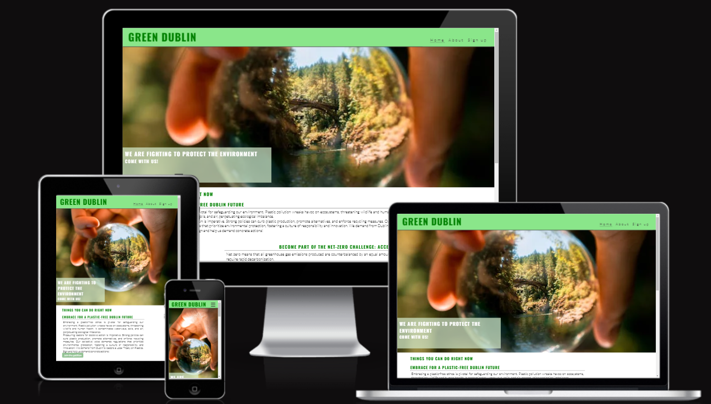

<h2>Green Dublin</h2>

Green Dublin is a site that was created because the planet and its ecosystems need people to defend them. It wants to encourage voolunteering and confront companies and projects that contribute to the global climate crisis and the incresing level of pollution on our planet.

Users of this website will find the actions that are in course by Green Dublin non-profit organization, a link to signup to become a volunteer and a easy way to join a petition. Will find pictures in all pages, that reminds the importance of being an activist and hope to incentivate the colaboration to the campaigns and actions. 

;

<h2>Features</h2>
<ol>
<li><h3>Navigation bar</h3></li>

Featured at the top of the page is full responsive and includes a Home section, an About section and a Sign Up section.

This section will allow the user to easily navigate on the site and on all different devices.

The navigation use the green background, that is the base color of the site

<li><h3>Home page</h3></li>
<li><h3>About page</h3></li>
<li><h3>Sign Up page</h3></li>
<li><h3>Petition Page</h3></li>
</ol>

<h2>Testing</h2>

<h2>Bugs</h2>

 No bugs were detected on the wesite.

<h2>Validator testing</h2>

 HTML validation: no errors were found  on the official W3C validator

 CSS validation: no errors were found  on the official (Jigsaw) validator

 Acessibility

<h2>Deployment</h2>

 Green Dublin was deployed by GitHub pages, only two erros was detected:

 On the Petittion page: the text "!DOCTYPE html" was missing;

 On the forms of the Petittion page and Sign Up page: the labor for had a name with space in it.

<h2>Credits</h2>
<h3> Content</h3>

 The social media links was taken from CI Love Running Project.

<h3> Media</h3>

 The images was taken from Pexels and Istockphoto websites.
